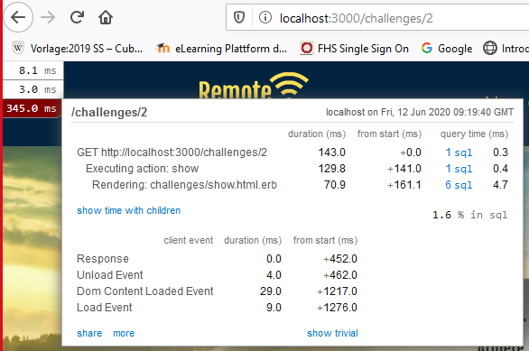
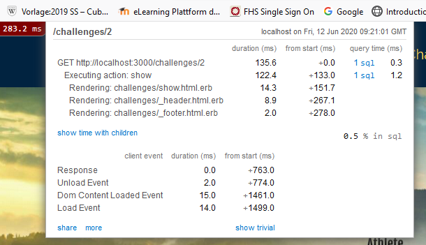
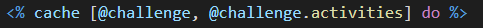
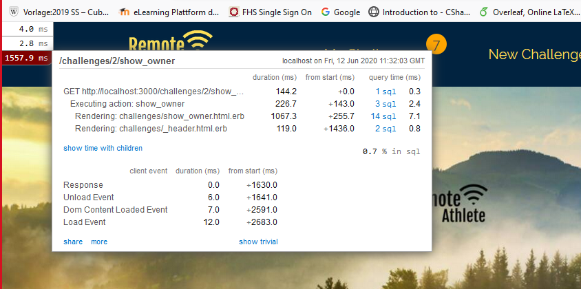
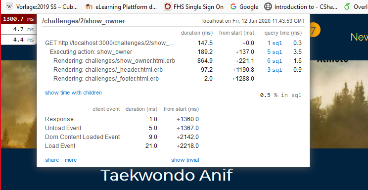
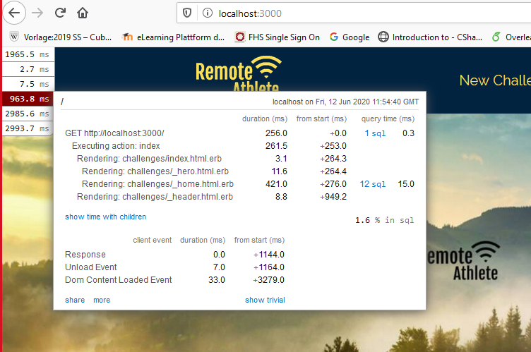
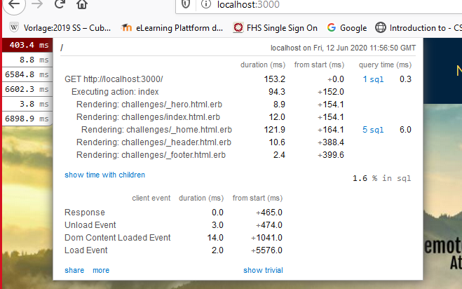

# README

This is our MMP2b from Maria Edlinger, Jonathan Lex and Markus Wallner

## Up and running

``rails s`` Starts rails server

``npm run lint`` Starts standard linting

``npm run server`` Starts webpack-Server for development

## Tests

``rails spec`` Runs all tests

``rails spec:system`` Runs the system tests

## Caching
 
vorher:  
  

### 1. Fragment Caching
danach haben wir Fragment Caching angewandt  
  

### 2. Russian Doll Caching
Wir hatten das Problem, dass wenn eine Activity bearbeitet wurde, der alte Cache geladen wurde, weil eine Abhängigkeit von den Challenges zu den Activities fehlte. Deshalb diese Verbesserung im Code:  
  

### 3. n+1 queries
 
vorher:  
  

wir haben users und requests included:  
  

### 4. zusätzliches Fragment Caching  

bei Punkt 1 & 2 wo wir die Show-Seite gecacht haben, hatten wir das Problem, dass die Seite unterschiedlich aussieht abhängig davon ob ein User eingeloggt ist oder nicht. Deshalb mussten wir das Fragment Caching entfernen und haben es auf jede Challenge der Index-Seite angewandt.  

vorher:  
  
nachher:  
  